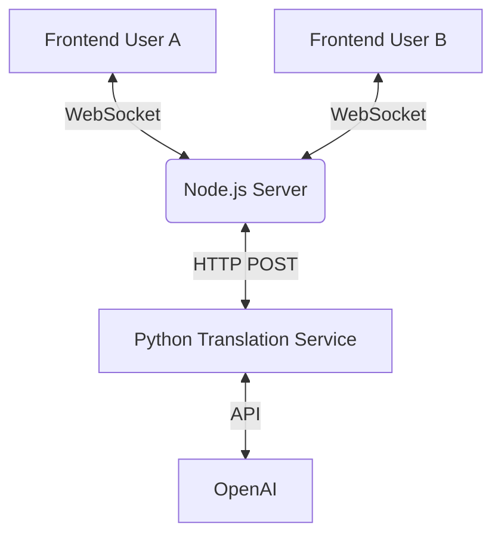

# 🌐 Real-Time Translation Chat

Ushbu loyiha ikki foydalanuvchi o'rtasida real vaqt rejimida ishlaydigan, avtomatik tarjima qilinadigan chat tizimidir.


## 🏗️ Arxitektura

Tizim uchta asosiy qismdan iborat:

1.  **Backend (Node.js + Socket.io):** WebSocket orqali foydalanuvchilarni ulaydi va xabarlarni almashadi.
2.  **Translation Service (Python + FastAPI):** Xabarlarni OpenAI yordamida tarjima qiladi.
3.  **Frontend (HTML/JS):** Foydalanuvchi interfeysi.



## 🚀 Ishga Tushirish Qo'llanmasi

Loyiha to'liq ishlashi uchun **ikkala** terminalda ham serverlarni ishga tushirishingiz kerak.

### Talablar
- Node.js (v14+)
- Python (v3.8+)
- OpenAI API Key

---

### 1-qadam: Python Translation Service ni Ishga Tushirish 🐍

Bu servis tarjima uchun javob beradi.

1.  Terminalni oching va `python-translate` papkasiga o'ting:
    ```bash
    cd python-translate
    ```

2.  Virtual muhit (venv) yarating (agar yo'q bo'lsa):
    ```bash
    python -m venv venv
    ```

3.  Virtual muhitni faollashtiring:
    - **Windows:** `venv\Scripts\activate`
    - **Mac/Linux:** `source venv/bin/activate`

4.  Kerakli kutubxonalarni o'rnating:
    ```bash
    pip install fastapi uvicorn openai python-dotenv
    ```

5.  `.env` fayl yaratib, OpenAI API kalitingizni yozing:
    ```env
    OPENAI_API_KEY=sk-sizning-api-kalitingiz
    ```

6.  Servisni ishga tushiring:
    ```bash
    python translate_service.py
    ```
    *Servis `http://localhost:5000` portida ishga tushadi.*

---

### 2-qadam: Node.js Backend ni Ishga Tushirish 🟢

Bu server chat va WebSocket ulanishlarini boshqaradi.

1.  **Yangi** terminal oching va `node_backend` papkasiga o'ting:
    ```bash
    cd node_backend
    ```

2.  Kutubxonalarni o'rnating:
    ```bash
    npm install
    ```

3.  Serverni ishga tushiring:
    ```bash
    node server.js
    ```
    *Server `http://localhost:3000` portida ishga tushadi.*

---

### 3-qadam: Chatdan Foydalanish 💬

1.  Brauzerni oching va quyidagi manzilga kiring:
    👉 **http://localhost:3000**

2.  O'z tilingizni tanlang (masalan, **Uzbek**) va "Join Chat" tugmasini bosing.

3.  Ikkinchi brauzer oynasini (yoki Incognito rejimda) oching va yana **http://localhost:3000** ga kiring.

4.  Boshqa tilni tanlang (masalan, **English**) va "Join Chat" tugmasini bosing.

5.  🎉 Tabriklaymiz! Endi siz bir-biringiz bilan o'z ona tilingizda gaplasha olasiz.

---

## 🛠️ Texnologiyalar

- **Frontend:** HTML5, CSS3, Vanilla JavaScript
- **Backend:** Node.js, Express, Socket.io
- **AI Service:** Python, FastAPI, OpenAI GPT-4o-mini

## 📝 Eslatma
Agar tarjima ishlamasa, Python terminalida xatolik yo'qligini va OpenAI API kaliti to'g'ri ekanligini tekshiring.
