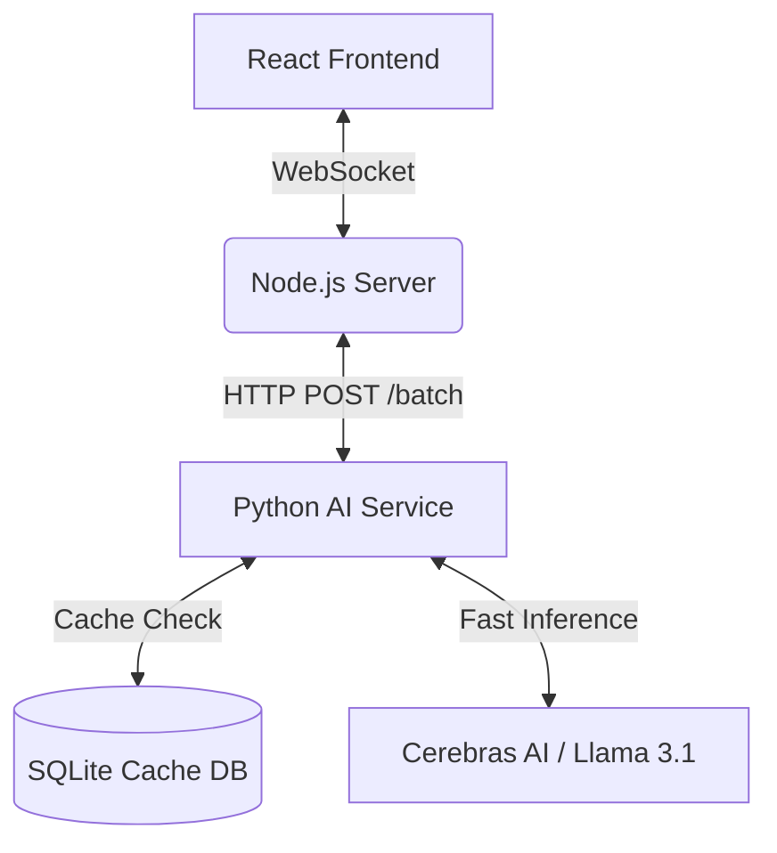

# 🌐 Real-Time AI Translation Chat (Optimized)

Ushbu loyiha ikki foydalanuvchi o'rtasida real vaqt rejimida ishlaydigan, avtomatik va aqlli tarjima qilinadigan chat tizimidir. Tizim Cerebras AI (Llama 3.1) va SQLite kesh yordamida maksimal darajada optimallashtirilgan.


## 🏗️ Arxitektura

Loyiha arxitekturasi murakkab bo'lishiga qaramay, uni ishga tushirish uchun bitta Automation Script tayyorlangan.


```mermaid
graph TD
    A[React Frontend] <-->|WebSocket| B(Node.js Server)
    B <-->|HTTP POST /batch| D[Python AI Service]
    D <-->|Cache Check| E[(SQLite Cache DB)]
    D <-->|Fast Inference| F[Cerebras AI / Llama 3.1]
```

## 🚀 Ishga Tushirish Qo'llanmasi

Loyiha arxitekturasi murakkab bo'lishiga qaramay, uni ishga tushirish uchun bitta **Automation Script** tayyorlangan.

### Talablar
- Node.js (v14+)
- Python (v3.8+)
- Cerebras API Key

---

### 1-qadam: Sozlamalar 🐍

python-translate papkasida .env faylini yarating va API kalitingizni kiriting:
```bash
CEREBRAS_API_KEY=sk-sizning-api-kalitingiz
```

### 2-qadam: Hammasini bittada ishga tushirish ⚡
Loyihaning ildiz (root) papkasida terminalni oching va quyidagi buyruqni bering:
```bash
python run.py
```
Ushbu script virtual muhitni yaratadi, kutubxonalarni o'rnatadi va Frontend hamda Backend terminallarini avtomatik tarzda yangi oynalarda ochib beradi.

## 🛠️ Aqlli Funksiyalar
- **🚀 Cerebras Inference:** Llama 3.1-8B modeli yordamida tarjima soniyaning kichik bo'laklarida amalga oshadi.
- **📦 Batch Translation:** Xabarlar 30 talab paketlanadi, bu API requestlar sonini 30 martagacha tejaydi.
- **💾 SQLite Cache:** Bir marta tarjima qilingan gap qayta AI ga yuborilmaydi, bazadan olinadi.
- **🛡️ Emoji Protection:** Emojilar tarjima qilinmaydi va o'z joyida qoladi.
- **🗣️ Slang & Typos:** Norasmiy matnlar (nima gap, ketyapman) kontekstga qarab to'g'ri o'giriladi.
- **🔄 Reply Translation:** Javob berilgan xabarlar (quotes) ham avtomatik tarjima qilinadi.

## 🛠️ Texnologiyalar

- **Frontend:** React.js (Vite), Tailwind CSS
- **Backend:** Node.js, Express, Socket.io
- **AI Service:** Python, FastAPI, Cerebras SDK
- **Database:** SQLite(Caching layer)

## 📝 Eslatma
Agar noto'g'ri tarjima saqlanib qolsa, python-translate/translations_cache.db faylini o'chirib yuboring va serverni qayta yoqing. Tizim avtomatik tarzda toza bazani yaratadi.
